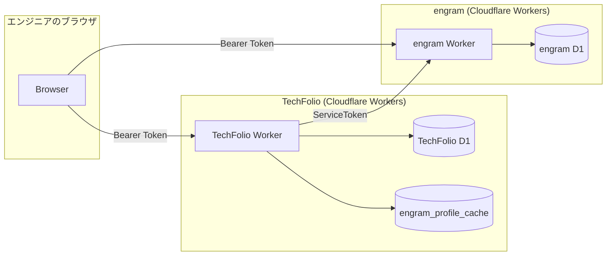
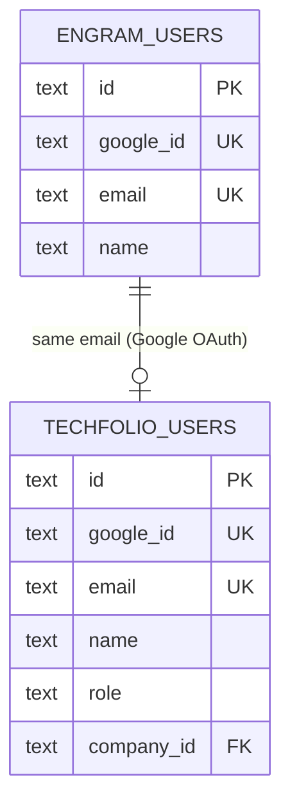
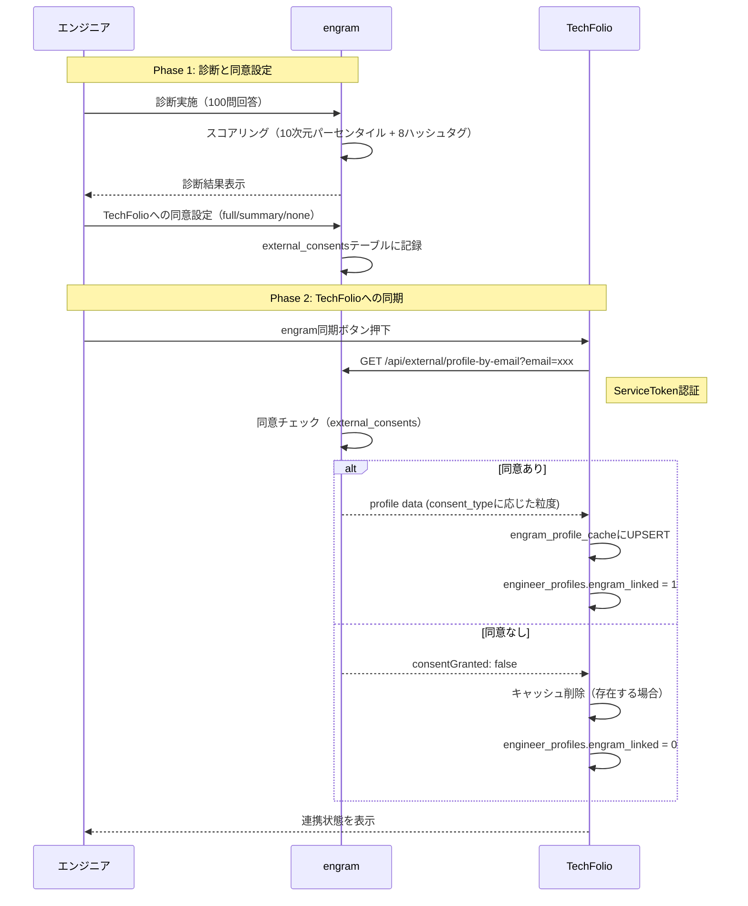
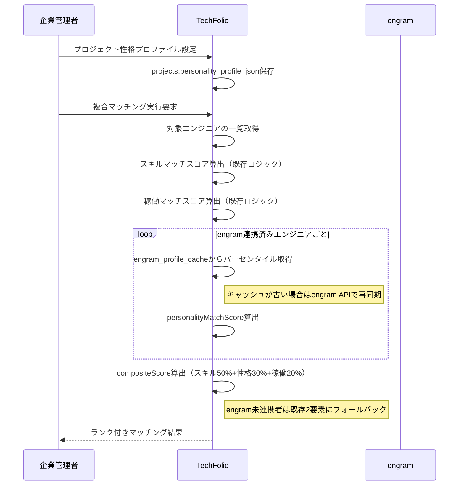
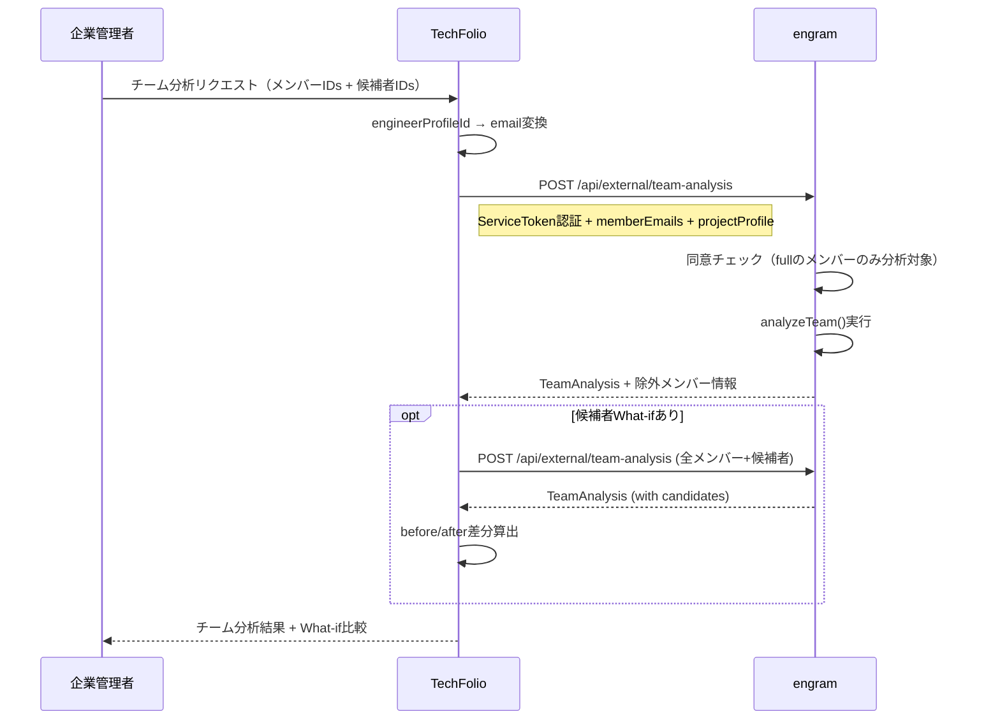
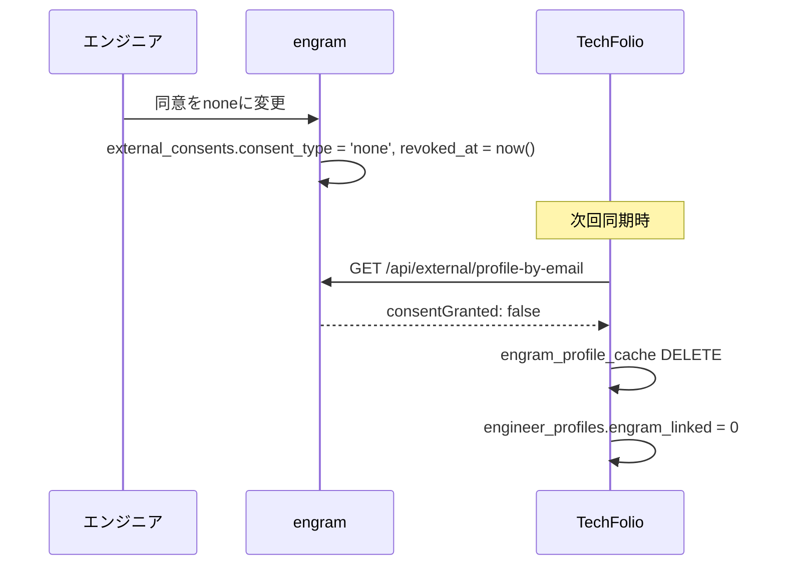

# engram x TechFolio 統合アーキテクチャ仕様

## 1. エグゼクティブサマリー

engram（超精密エンジニア診断：10次元/60ハッシュタグ/C(60,8)=25.6億通り）とTechFolio（エンジニアリソース管理SaaS）を統合し、国内エンジニア人材サービスにおいて競合空白地帯となっている「パーソナリティ診断+チーム構成分析+AI面談支援」の三位一体を実現する。

両システムは独立したCloudflare Workersデプロイメントであり、リポジトリも完全に分離されている。本仕様書では、両システムにまたがる統合アーキテクチャ、データフロー、責務分担、プライバシー設計を定義する。各システム固有の詳細要件は以下を参照のこと。

- engram側: `engram/docs/requirements/techfolio-integration-requirement.md`
- TechFolio側: `TechFolio/docs/requirements/engram-integration-requirement.md`

---

## 2. 統合アーキテクチャ

### 2.1 方式: API-based Federation

両システムは独立したCloudflare Workers上にデプロイされ、D1データベースも別々である。統合はサーバーサイドAPI呼び出しによるフェデレーション方式で実現する。

### 2.2 設計原則

| 原則 | 説明 |
|------|------|
| **データの正本** | 診断結果はengram側が唯一の正本。TechFolioはTTL付きキャッシュコピーを保持 |
| **サーバーサイド通信** | TechFolio WorkerがServiceToken認証でengram Worker APIを呼び出す。ブラウザからのcross-origin呼び出しは行わない |
| **疎結合** | engram APIが利用不能でもTechFolioの既存機能に影響しない。キャッシュにフォールバック |
| **完全オプトイン** | デフォルトでデータは共有されない。エンジニアがengram側で明示的に同意した場合のみ共有 |
| **生データ非公開** | 100問の個別回答データは外部に露出しない。提供するのはパーセンタイルとハッシュタグのみ |

### 2.3 認証方式

| 認証パス | 方式 | 用途 |
|---------|------|------|
| エンジニア → engram | Bearer Token（Lucia Auth v3 / Google OAuth） | 診断の実施、同意設定の管理 |
| エンジニア → TechFolio | Bearer Token（Lucia Auth v3 / Google OAuth） | プロフィール管理、engram同期トリガー |
| TechFolio Worker → engram Worker | ServiceToken（共有シークレット） | 診断データ取得、チーム分析リクエスト |

ServiceTokenは`Authorization: ServiceToken <token>`ヘッダーで送信する。engram側で`TECHFOLIO_SERVICE_TOKEN`環境変数と照合する。

---

## 3. ユーザー紐付け

### 3.1 方式: emailベースのフェデレーション

両システムはGoogle OAuth 2.0を認証基盤としており、usersテーブルにemailカラムを持つ。同一のGoogleアカウントでログインした場合、同一のemailが記録される。このemailを共通キーとしてユーザーを紐付ける。

### 3.2 紐付けフロー

1. エンジニアがengramで診断を完了 → engram.users.emailに記録
2. エンジニアがTechFolioにログイン → TechFolio.users.emailに記録
3. TechFolioがengram同期実行時、TechFolio側のemailでengram APIを呼び出し
4. engram APIがemail検索 → 同意チェック → 診断結果を返却

**IDの直接参照は行わない。** engram.users.idとTechFolio.users.idは独立した値であり、相互参照しない。emailが唯一のリンクキーである。

---

## 4. データフロー

### 4.1 診断結果の同期フロー

### 4.2 複合マッチングフロー

### 4.3 チーム分析フロー

---

## 5. 同意モデルとプライバシー設計

### 5.1 3段階の同意レベル

| レベル | engram APIが返すデータ | TechFolioでの利用 |
|--------|----------------------|------------------|
| **full** | 10次元パーセンタイル（数値）、ハッシュタグ8個（修飾子含む） | プロフィール表示、レーダーチャート、マッチングスコア算出、チーム分析、Resume Agent |
| **summary** | ハッシュタグ8個、上位3/下位3次元の名前（数値なし） | プロフィールのタグ表示、Resume Agentの性格コンテキスト |
| **none**（デフォルト） | 何も返さない | 「engram未連携」表示 |

### 5.2 プライバシー設計原則

1. **デフォルト非共有**: engram登録してもTechFolioには何も共有されない
2. **明示的同意**: engramのUI上でTechFolioへの共有を許可する画面を用意
3. **粒度制御**: full / summary / none の3段階
4. **いつでも撤回可能**: noneに変更すると次回同期時にTechFolio側キャッシュも削除
5. **生データ非公開**: answers_json（100問の回答）は外部APIに決して露出しない
6. **二重同意ゲート**: 公開ポートフォリオでのengram表示はengram同意+TechFolio公開設定の両方が必要
7. **オプトイン型**: Crystal Knowsのような推定ではなく、エンジニア自身が能動的に診断・共有

### 5.3 同意撤回時のデータフロー

---

## 6. 両システムの責務分担

| 責務 | engram | TechFolio |
|------|--------|-----------|
| 診断の実施・スコアリング | 担当 | — |
| 診断結果の保存（正本） | 担当 | — |
| 同意設定の管理 | 担当 | — |
| 同意に基づくデータ提供 | 担当 | — |
| チーム分析ロジック（analyzeTeam） | 担当 | — |
| ポジション/プロジェクトマッチロジック（computeMatchScore） | 担当 | — |
| Service Token認証の検証 | 担当 | — |
| 診断結果のキャッシュ保持 | — | 担当 |
| スキルマッチスコア算出 | — | 担当 |
| 複合マッチングスコア算出 | — | 担当 |
| プロフィールUI表示 | — | 担当 |
| チーム分析UIの構築 | — | 担当 |
| 公開ポートフォリオUI | — | 担当 |
| Resume Agent（AI面談Bot）の運用 | — | 担当 |
| EngramService（APIクライアント） | — | 担当 |

---

## 7. API一覧（両システム横断）

### engram側（Service Token認証）

| Method | Endpoint | 説明 |
|--------|---------|------|
| GET | /api/external/profile-by-email | 個人の性格プロフィール取得（email指定） |
| POST | /api/external/profiles-by-emails | 複数ユーザーの性格プロフィール一括取得（上限50件） |
| POST | /api/external/team-analysis | チーム構成分析の実行（上限20名） |
| GET | /api/external/dimensions | 10次元のディメンション定義取得 |

### engram側（ユーザー認証）

| Method | Endpoint | 説明 |
|--------|---------|------|
| GET | /api/consents | 自分の外部サービス同意一覧取得 |
| PUT | /api/consents/:serviceId | 同意設定の更新 |

### TechFolio側（エンジニア向け）

| Method | Endpoint | 説明 |
|--------|---------|------|
| GET | /api/me/engram-status | engram連携状態確認 |
| POST | /api/me/engram-sync | engram同期トリガー |

### TechFolio側（企業管理者向け）

| Method | Endpoint | 説明 |
|--------|---------|------|
| PUT | /api/admin/projects/:id/personality | プロジェクトの性格マッチング設定 |
| GET | /api/admin/projects/:id/composite-matches | 複合マッチング結果取得 |
| POST | /api/admin/projects/:id/team-analysis | チーム構成分析 |

---

## 8. フェーズ別実装計画（全体）

| Phase | 内容 | engram側 | TechFolio側 | 依存関係 |
|-------|------|---------|------------|---------|
| **1** | engram外部API基盤 | Service Token認証、同意管理、外部プロフィールAPI | なし | なし |
| **2** | TechFolio連携基盤 | なし | EngramService、engram_profile_cache、同期API、プロフィール表示 | Phase 1 |
| **3** | 複合マッチング | なし | projects personality設定、compositeScore算出、マッチング結果UI | Phase 2 |
| **4** | チーム分析 | /api/external/team-analysis | チーム分析タブ、What-if UI | Phase 2 |
| **5** | 公開ポートフォリオ | なし | public_profile_settings拡張、PublicProfile UI | Phase 2 |
| **6** | Resume Agent強化 | なし | meeting-bot.ts拡張、システムプロンプト強化 | Phase 2 |

Phase 1-2完了でMVP（エンジニアがengram結果をTechFolioに連携・表示）が動作する。Phase 3で差別化機能（性格+スキル複合マッチング）が利用可能になり、Phase 4でチーム構成最適化が完成する。Phase 3-6は並行実装可能。

---

## 9. 検証方法

### 9.1 単体テスト（各リポジトリ内）

**engram:**
- Service Token認証ミドルウェア: 有効トークン/無効トークン/トークンなしの3パターン
- 外部API各エンドポイント: 認証チェック、同意チェック（full/summary/none）、レスポンス形式
- 同意管理API: CRUD操作、バリデーション

**TechFolio:**
- EngramService: engram APIのモックテスト、エラーハンドリング、タイムアウト
- 複合スコア算出: personalityMatchScore有無による分岐、境界値テスト
- APIエンドポイント: 認証/認可、バリデーション、正常系/異常系

### 9.2 結合テスト

- engram Worker + TechFolio Worker をローカルで起動（wrangler dev）
- 実際のServiceTokenでAPI呼び出しが成功することを確認
- 同意レベル別（full/summary/none）の挙動確認
- 同意撤回後のキャッシュ削除確認

### 9.3 E2Eシナリオ

1. エンジニアがengramで診断を完了する
2. engram側でTechFolioへの同意をfullに設定する
3. TechFolioにログインし「engram同期」を実行する
4. マイページにハッシュタグとレーダーチャートが表示されることを確認する
5. 企業管理者がプロジェクトに性格プロファイルを設定する
6. 複合マッチング結果でエンジニアがスキル+性格+稼働の複合スコアでランク表示されることを確認する
7. チーム分析タブでアサイン済みメンバーの強み/弱み/推奨事項を確認する
8. 候補者追加What-ifシミュレーションでbefore/after比較を確認する
9. エンジニアがengramで同意をnoneに変更する
10. TechFolioで再同期後、engramデータが削除されていることを確認する

---

## 10. 技術的制約

| 制約 | 詳細 | 対策 |
|------|------|------|
| Cloudflare Workers CPU制限 | 無料枠: 10ms/リクエスト | 一括取得の上限を50件に制限。チーム分析は20名まで |
| Cloudflare Workers リクエスト制限 | 無料枠: 100K/日 | TechFolio→engram APIコールはユーザーアクション起点のみ（バッチ同期は行わない） |
| D1 SQLite | cross-DB joinは不可能 | emailベースのAPI呼び出しでデータを連携 |
| 独立デプロイメント | 同一リリースタイミングを保証できない | APIバージョニング（将来）、後方互換性の維持 |
| ネットワークレイテンシ | Worker間通信は同一Cloudflareエッジ内でも数十ms | キャッシュ戦略（TTL 24時間）でAPI呼び出し頻度を削減 |
